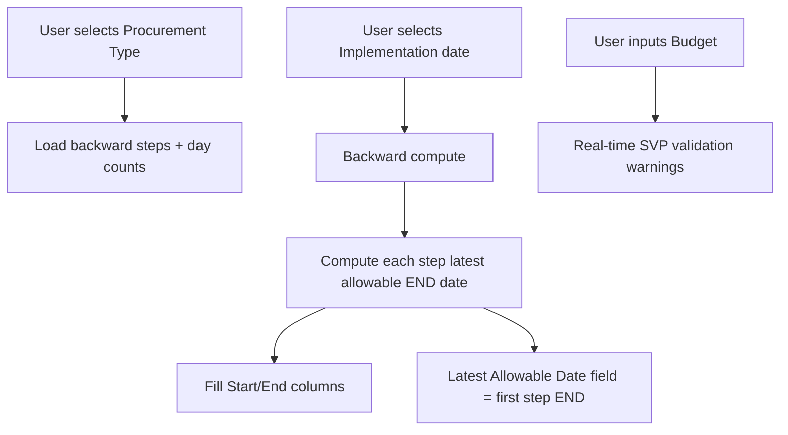

## Key changes

1. Consolidate the UI
  - Remove the entire card section labeled “Procurement Timeline Estimator” (the quick estimator form that calls `calculateTimeline()`).
  - Rename the card header “Procurement Timeline Planner” to “Procurement Timeline Estimator” (text only).
2. Extend the remaining estimator table
  - Add a dropdown to select “Procurement Type / Mode of Procurement”.
  - Add an “Estimated Budget (PHP)” input and show SVP validation warnings in real time.
  - Repurpose the existing date picker to represent the *Implementation date* (per your requirement) and run backward tracking from it.
  - Add a read-only “Latest Allowable Date” field at the bottom of the estimator.
3. Implement backward tracking (latest allowable schedule)
  - Replace the hard-coded `PLANNER_STAGES` with procurement-type-specific backward steps and day counts from `config/procurement.php` (`backward_timeline_stages`).
  - For the selected implementation date, compute backward through each backward step:
    - Set an internal cursor to `implementationDate - 1 day`.
    - Iterate steps from last to first, computing each step’s latest allowable END date and derived START date using the same zero-day milestone behavior as the backend `ProcurementTimelineService`.
  - Populate the table:
    - Fill “End Date” as the latest allowable date per step.
    - Fill “Start Date” derived from END date and effective duration.
  - Compute the bottom “Latest Allowable Date” as the END date of the first backward step.
4. Real-time budget validation (SVP only)
  - When procurement type is `SMALL_VALUE_PROCUREMENT` (SVP 200k and below):
    - Warn if `budget >= 200000.00` with: `The budget for Small Value Procurement (200k and below) must not exceed 199,999.99.`
  - When procurement type is `SMALL_VALUE_PROCUREMENT_200K` (SVP 200k and above):
    - Warn if `budget < 200000.00` with: `The minimum budget for this procurement type is 200,000.00.`
    - Warn if `budget >= 2000000.00` with: `The maximum budget for this procurement type is 1,999,999.99.`
  - Apply validation on `input` / `change` events (not only on submit).

## File(s) to change

- `[admin/landing.php](admin/landing.php)`

## Implementation notes

- Filter the dropdown to procurement types that exist in `procurementConfig()['workflows']` (the config currently lacks `DIRECT_PROCUREMENT_STI`).
- Keep the existing table structure/columns, but make the calculated date inputs read-only so the schedule is fully driven by implementation date + step durations + “Add days”.
- Update `computeEarliest()`, `computeLatest()`, `updateRow()`, and the row rendering logic so they call the new backward-tracking compute function instead of the current forward/percentage buffer approach.

### Backward scheduling (concept)

